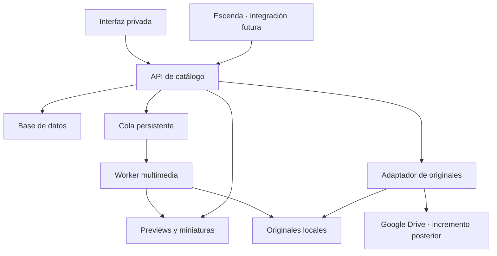

# Arquitectura propuesta
Propuesta técnica para validar mediante ADR-001; no es una implementación existente.

## Componentes
- Interfaz web React + TypeScript, construida con Vite.
- API Python con FastAPI para catálogo, selecciones y entrega controlada de archivos.
- Worker Python con FFmpeg/ffprobe para análisis y derivados; límites de concurrencia, tiempo y tamaño.
- SQLite local para E1, migraciones desde el inicio. Un solo servidor dueño del catálogo.
- Almacenamiento por adaptadores: local primero, Google Drive después. iCloud como copia gestionada aparte, sin integración en V1.
La base de datos activa no se comparte por sincronización de OneDrive/Drive. Mantener datos de ejecución fuera de la carpeta sincronizada del código y respaldar mediante snapshots consistentes.

## Modelo
Asset: UUID estable, título original y título visible, tipo, descripción y procedencia de esa descripción.
AssetVersion: hash SHA-256 completo cuando los bytes estén disponibles, tamaño y metadatos medidos.
Location: proveedor, identificador externo o raíz relativa, estado disponible/offline; varias ubicaciones por versión.
Pack y PackEntry: compra/procedencia, archivo contenedor y ruta interna; identidad provisional de entrada antes de extraer.
Derivative: versión fuente, receta versionada, tipo, ruta y estado.
Collection / CollectionAsset y Selection / SelectionItem: relaciones, notas, orden; favoritos persistentes.
Job: estado, intentos, progreso y error legible.
Mantener UUID estable al mover archivos. Un hash identifica bytes, no reemplaza todas las identidades ni las procedencias.
Ediciones humanas no se sobrescriben al volver a analizar.

## Procesamiento
Descubrir → inventariar → poner en cola → analizar → generar derivados → revisar.
Reimportación idempotente. Reintentar solo trabajo pendiente o fallido; invalidar derivados si cambian bytes o receta.
Hash completo antes de confirmar duplicado. Nombre+tamaño solo candidatos. No borrar duplicados automáticamente.
ZIP: validar rutas contra traversal y rutas absolutas, limitar expansión/tamaño/niveles, rechazar enlaces inseguros. No extraer recursivamente todo.
Extracción selectiva en caché separada y con control de espacio; registrar errores sin perder el lote.

## API orientativa
GET /api/assets con filtros y cursor; GET/PATCH /api/assets/{id}.
GET /api/assets/{id}/preview; GET /api/assets/{id}/original.
CRUD /api/collections y /api/selections; membresía idempotente por asset.
POST /api/imports; GET /api/jobs/{id}; acciones de cancelación/reintento.
Original se resuelve por ID, nunca por una ruta arbitraria enviada por cliente.
Entregar archivos con soporte de rangos para navegación temporal cuando corresponda.

## Ejecución y despliegue
E1: frontend/API/worker en el ordenador que contiene las muestras, ligados a loopback.
Etapa online: catálogo y previews privados en servidor; autenticación antes de servir medios. Dominio previsto trama.jrgblanco.com.
Originales Drive mediante OAuth con alcance mínimo necesario. Credenciales solo backend, sin carpetas públicas ni enlaces permanentes expuestos.
Si un original sigue solo en un ordenador apagado, el servidor no puede obtenerlo. Mantener ese estado explícito.
La subida a Drive debe ser reanudable y verificable, como tarea distinta de catalogar.
Permitir snapshots de catálogo y restauración ensayada; respaldar originales y derivados según política de retención.
